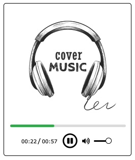
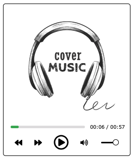
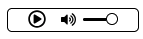
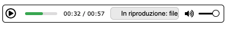

# RPlayer
My custom audio player in HTML5 and JavaScript without dependencies.

### Features

  - [x] Use button or space bar to play/pause audio file.
  - [x] Clickable progress bar to advance through the audio track at will.
  - [x] Display of audio track duration (minutes and seconds) and progress during playback.
  - [x] Interactive sound bar to adjust playback volume.
  - [x] Use the button for audio, to set or remove the “mute” mode during playback.
  - [x] Light/Dark Theme.
  - [x] Ability to start multiple instances of the player at the same time.

### Upcoming

  - [ ] Audio Playlist Management *in development*
  - [ ] Display "Next" and "Previous" buttons (and enable their functionality) with more audio track. *in testing*
  - [ ] Display "Random" (or "Shuffle") button (and enable their functionality) with more audio track.
  - [ ] Display "Loop" button (and enable their functionality).
  - [ ] Display audio cover image or show default image for audio files with no cover image.
  - [ ] Display the song title or audio file name.
  - [ ] Different skins to choose for the player interface. *in development*
  - [ ] Audio visualizer (audio spectrum) *in development*

### Preview

With the first version currently available you will get what can be seen in the screenshot available below.

|  |  |
| :---: | :---: |
| Light Theme | Dark Theme |

### New Concepts

|  |  |  |
| :---: | :---: | :---: |
| New Default Theme | Minimal Theme | Walkman Theme |

### Support

If you are interested in the Project and would like to support me, you could contribute to its development, with new ideas, advice or a tiny donation.

If you spot a bug, please submit a [detailed issue](https://github.com/A35G/RPlayer/issues/new?assignees=&labels=bug%2Cunconfirmed&template=bug_report.yml).

Even a simple interest, is always welcome :wink:
